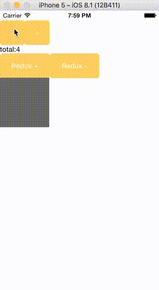

# React Native App With Redux

This a simplest iOS **React Native** App with redux, which is inspired by https://github.com/jackielii/simplest-redux-example 

It has two groups buttons, which are used to compare differences between the normal approach and the approach with redux to change the state and refresh UI. 

# Start

- Clone

```
git clone git@github.com:niyaoyao/react-native-redux-app.git
```

- Install

```
cd react-native-redux-app/ny_react
npm install
```

- Run

You can build and run App with Xcode.

# Demonstrate

